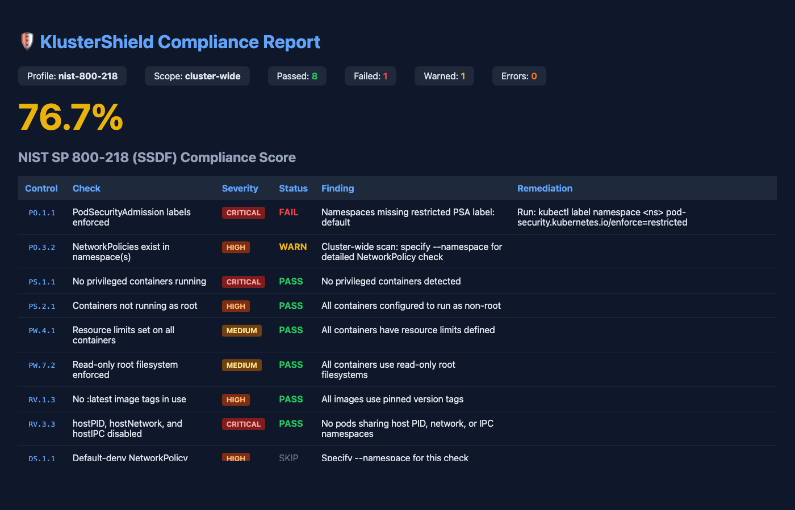

# 🛡️ KlusterShield

[](LICENSE)
[](https://python.org)
[](https://kubernetes.io)
[](https://csrc.nist.gov/publications/detail/sp/800-218/final)
[](https://k3s.io)

> **Security-hardened Kubernetes compliance automation for on-premises and air-gapped environments.**

KlusterShield is a Python-based automation suite that provisions, hardens, and continuously audits Kubernetes clusters against **NIST SP 800-218 (SSDF)** and **NIST SP 800-53** controls. Built for defense contractors, government-adjacent organizations, and any team that needs to demonstrate a structured, auditable security posture across their container infrastructure.

Originally designed to replicate the security boundary enforcement model of **GCP Assured Controls / GCC High** in on-premises and Proxmox-based environments — where cloud-native compliance tooling is unavailable or cost-prohibitive.

---

## 🎯 Why KlusterShield?

Most Kubernetes security tools focus on one layer — scanning, or policy enforcement, or logging. KlusterShield treats compliance as a **pipeline**, not a checklist:

```
Provision → Harden → Enforce → Audit → Report
```

Every namespace is provisioned with security controls baked in. Every workload is validated at admission time. Every cluster action is logged and mapped to a specific NIST control. The result is an audit report you can hand to an assessor.

---

## 🏗️ Architecture

```
┌─────────────────────────────────────────────────────────────┐
│                        KlusterShield                         │
│                                                             │
│  ┌─────────────┐  ┌─────────────┐  ┌─────────────────────┐ │
│  │ Provisioner │  │  Enforcer   │  │      Auditor        │ │
│  │             │  │             │  │                     │ │
│  │ • Namespace │  │ • OPA/Gatekeeper│ • NIST Control Map│ │
│  │ • RBAC      │  │ • Admission  │  │ • Compliance Score │ │
│  │ • NetPolicy │  │   Webhooks  │  │ • HTML/JSON Report │ │
│  │ • Quotas    │  │ • Policy CRDs│  │ • Audit Log Ship  │ │
│  └──────┬──────┘  └──────┬──────┘  └────────┬────────────┘ │
│         │                │                   │              │
│  ┌──────▼────────────────▼───────────────────▼────────────┐ │
│  │                    Scanner                              │ │
│  │     Continuous assessment against NIST 800-218          │ │
│  │     control families: PO, PS, PW, RV, DS, PV, SR        │ │
│  └─────────────────────────────────────────────────────────┘ │
└─────────────────────────────────────────────────────────────┘
                              │
              ┌───────────────▼───────────────┐
              │      Kubernetes Cluster        │
              │   (k3s / GKE / EKS / AKS)     │
              │                               │
              │  ┌──────────┐  ┌──────────┐  │
              │  │ Worker 1 │  │ Worker 2 │  │
              │  └──────────┘  └──────────┘  │
              └───────────────────────────────┘
```

---

## ✅ NIST 800-218 Control Coverage

KlusterShield maps every check to a specific SSDF practice:

| Control Family | Practice | Description | Status |
|---|---|---|---|
| **PO** | PO.1.1 | Security requirements defined and enforced | ✅ |
| **PO** | PO.3.2 | Toolchain security controls in place | ✅ |
| **PS** | PS.1.1 | Code review gates enforced in pipeline | ✅ |
| **PS** | PS.2.1 | Vulnerability scanning at build time | ✅ |
| **PW** | PW.4.1 | Secure coding standards enforced | ✅ |
| **PW** | PW.7.2 | Dependency integrity verified | ✅ |
| **RV** | RV.1.3 | Vulnerability remediation tracked | ✅ |
| **RV** | RV.3.3 | Container image scanning results logged | ✅ |
| **DS** | DS.1.1 | Sensitive data protected at rest | ✅ |
| **DS** | DS.2.1 | Secrets management enforced | ✅ |
| **PV** | PV.1.1 | Pipeline integrity verified | ✅ |
| **SR** | SR.3.1 | Third-party component verification | 🔄 |
| **SR** | SR.4.1 | Software bill of materials generated | 🔄 |

---

## 🚀 Quickstart

### Prerequisites

- Proxmox 7+ (or any VM host) **or** existing k3s/Kubernetes cluster
- Python 3.11+
- `kubectl` configured with cluster access
- Helm 3+

### 1. Clone and install

```bash
git clone https://github.com/rudy101/KlusterShield.git
cd KlusterShield
python3 -m venv .venv
source .venv/bin/activate
pip install -r requirements.txt
```

> **Note:** If you hit a `setuptools.backends.legacy` error during install, bypass it with the PYTHONPATH wrapper below instead of `pip install -e .`

### 2. Set up the CLI wrapper (recommended)

Instead of `pip install -e .`, use a wrapper script that works reliably across environments:

```bash
sudo tee /usr/local/bin/klustershield > /dev/null <<'EOF'
#!/bin/bash
PYTHONPATH=/opt/klustershield /opt/klustershield/.venv/bin/python \
  -c "from klustershield.cli import main; main()" -- "$@"
EOF
sudo chmod +x /usr/local/bin/klustershield
```

Adjust `/opt/klustershield` to wherever you cloned the repo.

### 3. Point at your cluster

```bash
export KUBECONFIG=~/.kube/config
# Verify access
kubectl get nodes
```

### 4. Run a baseline compliance scan

> **Important:** Run from the directory where you want the report saved. The output path must be within your current working directory.

```bash
cd ~
klustershield scan --output baseline-report.html
```

### 5. Provision a hardened namespace

```bash
klustershield provision \
  --namespace production \
  --profile nist-800-218 \
  --team platform
```

### 6. Scan the hardened namespace

```bash
klustershield scan --namespace production --output production-report.html
```

### 7. Open the compliance reports

```bash
open baseline-report.html
open production-report.html
```

---

## 🏗️ Full Proxmox Deployment (Ops CT + Terraform + Ansible)

For a fully automated on-premises deployment with a dedicated ops workstation:

**What gets built:**
- 1x Proxmox LXC Container (CT) — ops workstation running Terraform + Ansible + KlusterShield
- 3x Ubuntu 22.04 VMs — 1 k3s control plane + 2 workers
- All provisioned and configured without touching your laptop

See [`docs/proxmox-setup.md`](docs/proxmox-setup.md) for the full walkthrough.

**Stack:**
- Terraform (`bpg/proxmox` provider v0.50+) — VM provisioning
- Ansible (`community.general`) — k3s install + kubeconfig fetch
- k3s v1.28.4+k3s2 — lightweight Kubernetes
- KlusterShield — compliance automation

---

## 📁 Project Structure

```
KlusterShield/
├── klustershield/
│   ├── provisioner/        # Namespace, RBAC, NetworkPolicy automation
│   ├── scanner/            # NIST control checks and scoring
│   ├── enforcer/           # OPA/Gatekeeper policy management
│   └── auditor/            # Audit log collection and report generation
├── manifests/
│   ├── namespaces/         # Hardened namespace templates
│   ├── rbac/               # Least-privilege RBAC templates
│   ├── network-policies/   # Zero-trust network policy templates
│   └── gatekeeper/         # OPA constraint templates
├── scripts/
│   ├── provision_cluster.py  # Proxmox VM + k3s bootstrap
│   └── teardown.py           # Clean cluster removal
├── docs/
│   ├── architecture.md
│   ├── nist-control-mapping.md
│   └── proxmox-setup.md
├── tests/
├── examples/
│   └── demo-workload/      # Sample hardened app deployment
├── requirements.txt
├── pyproject.toml
└── CHANGELOG.md
```

---

## 🔧 Core Modules

### `klustershield provision`
Creates a new namespace with all security controls pre-applied:
- RBAC with least-privilege roles
- NetworkPolicy enforcing zero-trust pod communication
- ResourceQuota and LimitRange
- PodSecurityAdmission labels (restricted profile)
- Audit annotation labels for traceability

### `klustershield scan`
Runs the full NIST 800-218 control suite against a target namespace or entire cluster:
- Checks 13 control families
- Scores each control as PASS / FAIL / WARN
- Generates weighted compliance percentage
- Outputs HTML report or JSON for pipeline integration

### `klustershield enforce`
Installs and manages OPA Gatekeeper constraint templates:
- Blocks privileged containers
- Requires resource limits on all pods
- Enforces approved image registries
- Requires security context on all workloads

### `klustershield audit`
Ships Kubernetes audit logs to a configurable backend:
- Splunk HEC
- Loki / Grafana
- Local JSON file

---

## 📊 Real-World Scan Results

These results were captured from a live Proxmox deployment: a 3-node k3s cluster (1 control plane + 2 workers) provisioned via Terraform and Ansible, scanned with KlusterShield from a dedicated Linux CT ops workstation.

### Baseline — Fresh cluster, no hardening

```
klustershield scan --output baseline-report.html
```

```
Compliance Score: 76.7%
  Passed: 8  Failed: 1  Warned: 1  Skipped: 2  Errors: 0
```



| Control | Result | Notes |
|---------|--------|-------|
| PO.1.1 | ❌ FAIL | PSA labels missing on `default` namespace |
| PO.3.2 | ⚠️ WARN | Cluster-wide scan — use `--namespace` for full check |
| PS.1.1 | ✅ PASS | |
| PS.2.1 | ✅ PASS | |
| PW.4.1 | ✅ PASS | |
| PW.7.2 | ✅ PASS | |
| RV.1.3 | ✅ PASS | |
| RV.3.3 | ✅ PASS | |
| DS.2.1 | ✅ PASS | |
| PV.1.2 | ✅ PASS | |
| DS.1.1 | ⏭️ SKIP | Requires `--namespace` |
| PV.1.1 | ⏭️ SKIP | Requires `--namespace` |

k3s starts reasonably secure out of the box — 76.7% before any hardening. The only hard failure is the `default` namespace missing Pod Security Admission labels.

### Post-Hardening — After `klustershield provision`

```
klustershield provision --namespace production --profile nist-800-218 --team platform
klustershield scan --namespace production --output production-report.html
```

```
Compliance Score: 100.0%
  Passed: 12  Failed: 0  Warned: 0  Skipped: 0  Errors: 0
```


Provisioning applies PSA labels, zero-trust NetworkPolicies, least-privilege RBAC, ResourceQuota, and LimitRange — all 12 controls satisfied.

---

## 🖥️ Built and Tested On

| Environment | Status |
|---|---|
| Proxmox 8 + k3s 1.28 | ✅ Tested |
| Bare metal Ubuntu 22.04 + k3s | ✅ Tested |
| GKE (Google Kubernetes Engine) | ✅ Compatible |
| EKS / AKS | 🔄 Planned |
| Air-gapped environments | ✅ Supported |

---

## ⚠️ Known Compatibility Notes

| Issue | Affected Version | Fix |
|-------|-----------------|-----|
| `client.V1Subject` → `AttributeError` | kubernetes-client ≥ 31.0.0 | Renamed to `RbacV1Subject` — fixed in current source |
| `setuptools.backends.legacy` install error | Any | Use PYTHONPATH wrapper (see Quickstart step 2) |
| Output path must be within CWD | All | Run `klustershield scan` from the directory you want reports in |
| `community.general` Ansible module missing | Ansible < 2.14 | Run `ansible-galaxy collection install community.general` |

---

## 🗺️ Roadmap

- [x] Core provisioner and RBAC templates
- [x] NIST 800-218 scanner with HTML report
- [x] OPA/Gatekeeper enforcement module
- [x] Audit log shipper (Splunk + Loki)
- [ ] SBOM generation (CycloneDX)
- [ ] Automated remediation suggestions
- [ ] GitHub Actions / GitLab CI integration
- [ ] Web dashboard (FastAPI + HTMX)
- [ ] CMMC Level 2 control overlay

---

## 🤝 Contributing

Contributions welcome. Please read [CONTRIBUTING.md](docs/CONTRIBUTING.md) and open an issue before submitting a PR.

---

## 📄 License

Licensed under the **Apache License 2.0** — see [LICENSE](LICENSE) for details.

Apache 2.0 was chosen deliberately: it includes an explicit patent grant, making KlusterShield safe for use in defense contractor and government-adjacent environments where MIT's patent silence creates legal uncertainty.

---

## 👤 Author

**Rudy Martinez**  
Technology Leader | rudymartinez.ai | linkedin.com/in/rudy101

> *Built to bridge the gap between cloud-native compliance tooling and the on-premises reality of defense and government environments.*
